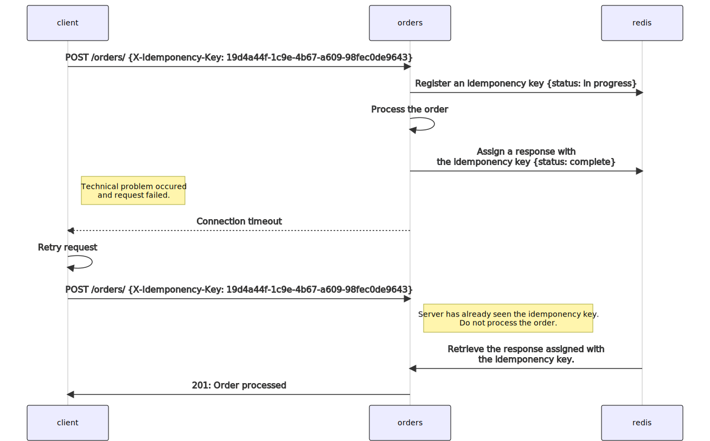
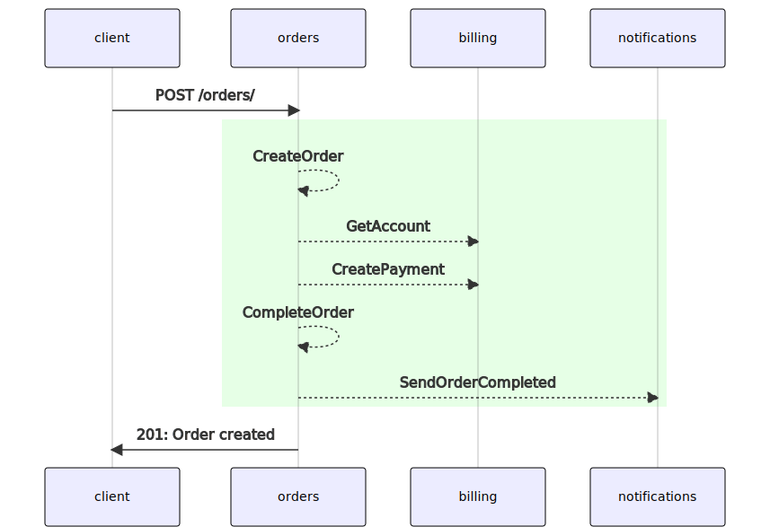

# otusidempotence

# Теория

## Идемпотентность


## Распределенные транзакции


[Реализация](./py/services/orders/orders/use_cases/order.py)

В сагу объединены операции:
* `CreateOrder`
* `GetAccount`
* `CreatePayment`
* `CompleteOrder`
* `SendOrderCompleted`

### CreateOrder

Операция создания заказа. Компенсирующей транзакцией для `CreateOrder` является изменение статуса заказа на `cancelled`.

Сама операция `CreateOrder` выполняется в рамках транзакции PostgreSQL. И, в случае возникновения ошибки, PostgreSQL откатит изменения в БД.

### GetAccount

Операция получения идентификатора счета пользователя. Компенсирующая транзакция также не нужна, поскольку операция не изменяет данные.

Однако, если в микросервисе `billing` происходит сбой, мы должны будем выполнить компенсирующую транзакцию `CreateOrder`, которая переведет заказ в статус `cancelled`.

### CreatePayment

Списывает деньги со счета пользователя. Списание происходит путем создания платежной транзакции типа `payment`.

Компенсирующей транзакцией для `CreatePayment` является создание платежной транзакции типа `payment_refund`.

### CompleteOrder

Переводит заказ в статус `complete`. Компенсирующая транзакция переводит заказ в предыдущий статус `processing`.

### SendOrderCompleted

Уведомляет другие микросервисы о завершении заказа. Компенсирующей транзакции нет.


# Prerequisites

* Kubernetes 1.21.2
* Helm 3.6.3
* Istio 1.10.3
* Skaffold

# Run

## Add Helm repos

```
helm repo add bitnami https://charts.bitnami.com/bitnami
helm repo add kiali https://kiali.org/helm-charts
helm repo add jaeger https://jaegertracing.github.io/helm-charts
helm repo add prometheus https://prometheus-community.github.io/helm-charts
```

## Create k8s namespaces

```
kubectl apply -f deployments/k8s/namespaces.yaml
```

## Run with Skaffold

```
skaffold run
```

# Tests

```
newman run orders.postman_collection.json
```
